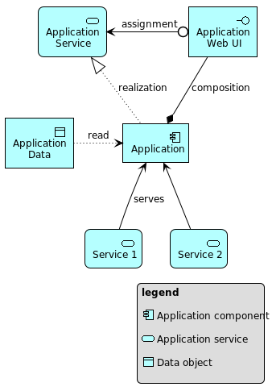

# Archimate-PlantUML
Archimate PlantUML

Macros for creating [Archimate](https://pubs.opengroup.org/architecture/archimate3-doc/) diagrams using [PlantUML](https://plantuml.com/).

## Installation

Download [Archimate.puml](Archimate.puml) and reference it as an import in PlantUML files:

```
!include path/to/Archimate.puml
```

## Usage

Requires [plantuml.jar](https://plantuml.com/download), and IDE plugin or one of the other ways of [running PlantUML](https://plantuml.com/running).

For examples of all Archimate elements and relationships with PlantUML see [archimate/ARCHIMATE.md](archimate/ARCHIMATE.md).  

### Archimate Elements

All element definitions follow the same pattern:

```
elementName('id', 'name', 'documentation`)
```

### Archimate Relationships

All relationship definitions follow the same pattern:

```
relationship('source', 'target', 'orientation', 'name', 'documentation')
```

`source` and `target` are the `id` of corresponding elements.

Orientation gives a layout hint for the orientation of the relationship.  Valid values are:

* '' (empty string for no hint)
* `left`
* `right`
* `up`
* `down`

No relationship validation is performed.

## Example

The PlantUML file below was used to create the diagram by running:

```
java -jar ~/lib/plantuml.jar example-1.puml
```

During processing information about the diagram elements is logged and can be used for further processing.
For example the definition list below the diagram shows the documentation for the model elements.  It was made using the 
following command:

```
java -jar ~/lib/plantuml.jar example-1.puml  2>&1  | awk -F '","|"' 
 'BEGIN{print "<dl>"}{printf("<dt>%s</dt><dd><i>[%s]:</i>  %s</dd>\n",$5,$3,$6)}END{print "</dl>"}'
```

example-1.puml:
```
@startuml
!include Archimate.puml

skinparam wrapWidth 80

applicationComponent('a', 'Application', 'This is the application component.')
dataObject('d', 'Application Data', 'The application reads this data.')
applicationService('s', 'Application Service', 'The service the application provides.')
applicationInterface('ui','Application Web UI','The application UI.')
applicationService('s1', 'Service 1', 'Provides service 1.')
applicationService('s2', 'Service 2', 'Provides service 2.')

accessR('a', 'd', 'left', 'read', '')
realization('a', 's', 'up', 'realization', '')
serving('s1', 'a', 'up', 'serves','')
serving('s2', 'a', 'up', '','')
composition('a', 'ui', 'up', 'composition', '')
assignment('ui', 's', 'left', 'assignment', '')
@enduml
```



<!-- this list was auto generated from example-1.puml -->
<dl>
<dt>Application</dt><dd><i>[Application component]:</i>  This is the application component.</dd>
<dt>Application Data</dt><dd><i>[Data object]:</i>  The application reads this data.</dd>
<dt>Application Service</dt><dd><i>[Application service]:</i>  The service the application provides.</dd>
<dt>Application Web UI</dt><dd><i>[Application interface]:</i>  The application UI.</dd>
<dt>Service 1</dt><dd><i>[Application service]:</i>  Provides service 1.</dd>
<dt>Service 2</dt><dd><i>[Application service]:</i>  Provides service 2.</dd>
</dl>
<!-- end of auto generated list -->

## Development

`Archimate.puml` and demo files are generated using [archimate/archimate.go](archimate/archimate.go).  Please refer to this file for details.