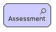

# Archimate

Archimate functions for PlantUML.

All element definitions follow the same pattern:

```
elementName('id', 'name', 'documentation`)
```

All elements have a corresponding sprite function (except for a small number missing from the plantuml.jar) for use in
legends etc:

```
elementNameKey('id', 'name', 'documentation`)
```

All relationship definitions follow the same pattern:

```
relationship('source', 'target', 'orientation', 'name', 'documentation')
```

`source` and `target` are the `id` of corresponding elements.

Orientation gives a layout hint for the orientation of the relationship.  Valid values are:

* '' (empty string for no hint)
* `left`
* `right`
* `up`
* `down`

## Archimate Elements

***Note:*** this file is generated using `archimate.go`, do not edit.


### Motivation Elements

Element | PlantUML | Definition | Notation
------ | ------ | ------- | :-------:
Stakeholder | `stakeholder(...)`  | Represents the role of an individual, team, or organization (or classes thereof) that represents their interests in the effects of the architecture. |  
Driver | `driver(...)`  | Represents an external or internal condition that motivates an organization to define its goals and implement the changes necessary to achieve them. |  
Assessment | `assessment(...)`  | Represents the result of an analysis of the state of affairs of the enterprise with respect to some driver. |  
Goal | `goal(...)`  | Represents a high-level statement of intent, direction, or desired end state for an organization and its stakeholders. |  
Outcome | `outcome(...)`  | Represents an end result. |  
Principle | `principle(...)`  | Represents a statement of intent defining a general property that applies to any system in a certain context in the architecture. |  
Requirement | `requirement(...)`  | Represents a statement of need defining a property that applies to a specific system as described by the architecture. |  
Constraint | `constraint(...)`  | Represents a factor that limits the realization of goals. |  
Meaning | `meaning(...)`  | Represents the knowledge or expertise present in, or the interpretation given to, a concept in a particular context. |  
Value | `value(...)`  | Represents the relative worth, utility, or importance of a concept. |  


### Strategy Elements

Element | PlantUML | Definition | Notation
------ | ------ | ------- | :-------:
Resource | `resource(...)`  | Represents an asset owned or controlled by an individual or organization. |  
Capability | `capability(...)`  | Represents an ability that an active structure element, such as an organization, person, or system, possesses. |  
Value stream | `valueStream(...)`  | Represents a sequence of activities that  create an overall result for a customer, stakeholder, or end user. |  
Course of action | `courseOfAction(...)`  | Represents an approach or plan for configuring some capabilities and resources of the enterprise, undertaken to achieve a goal. |  


### Business Layer Elements

Element | PlantUML | Definition | Notation
------ | ------ | ------- | :-------:
Business Actor | `businessActor(...)`  | Represents a business entity that is capable of performing behavior. |  
Business role | `businessRole(...)`  | Represents the responsibility for performing specific behavior, to which an actor can be assigned, or the part an actor plays in a particular action or event. |  
Business collaboration | `businessCollaboration(...)`  | Represents an aggregate of two or more business internal active structure Elements that work together to perform collective behavior. |  
Business interface | `businessInterface(...)`  | Represents a point of access where a business service is made available to the environment. |  
Business process | `businessProcess(...)`  | Represents a sequence of business behaviors that achieves a specific result such as a defined set of products or business services. |  
Business function | `businessFunction(...)`  | Represents a collection of business behavior based on a chosen set of criteria (typically required business resources and/or competencies), closely aligned to an organization, but not necessarily explicitly governed by the organization. |  
Business interaction | `businessInteraction(...)`  | Represents a unit of collective business behavior performed by (a collaboration of) two or more business actors, business roles, or business collaborations. |  
Business event | `businessEvent(...)`  | Represents an organizational state change. |  
Business service | `businessService(...)`  | Represents explicitly defined behavior that a business role, business actor, or business collaboration exposes to its environment. |  
Business object | `businessObject(...)`  | Represents a concept used within a particular business domain. |  
Contract | `contract(...)`  | Represents a formal or informal specification of an agreement between a provider and a consumer that specifies the rights and obligations associated with a product and establishes functional and non-functional parameters for interaction. |  
Representation | `representation(...)`  | Represents a perceptible form of the information carried by a business object. |  
Product | `product(...)`  | Represents a coherent collection of services and/or passive structure Elements, accompanied by a contract/set of agreements, which is offered as a whole to (internal or external) customers. |  


### Application Layer Elements

Element | PlantUML | Definition | Notation
------ | ------ | ------- | :-------:
Application component | `applicationComponent(...)`  | Represents an encapsulation of application functionality aligned to implementation structure, which is modular and replaceable. |  
Application collaboration | `applicationCollaboration(...)`  | Represents an aggregate of two or more application internal active structure Elements that work together to perform collective application behavior. |  
Application interface | `applicationInterface(...)`  | Represents a point of access where application services are made available to a user, another application component, or a node. |  
Application function | `applicationFunction(...)`  | Represents automated behavior that can be performed by an application component. |  
Application interaction | `applicationInteraction(...)`  | Represents a unit of collective application behavior performed by (a collaboration of) two or more application components. |  
Application process | `applicationProcess(...)`  | Represents a sequence of application behaviors that achieves a specific result. |  
Application event | `applicationEvent(...)`  | Represents an application state change. |  
Application service | `applicationService(...)`  | Represents an explicitly defined exposed application behavior. |  
Data object | `dataObject(...)`  | Represents data structured for automated processing. |  


### Technology Layer Elements

Element | PlantUML | Definition | Notation
------ | ------ | ------- | :-------:
Node | `node(...)`  | Represents a computational or physical resource that hosts, manipulates, or interacts with other computational or physical resources. |  
Device | `device(...)`  | Represents a physical IT resource upon which system software and artifacts may be stored or deployed for execution. |  
System software | `systemSoftware(...)`  | Represents software that provides or contributes to an environment for storing, executing, and using software or data deployed within it. |  
Technology collaboration | `technologyCollaboration(...)`  | Represents an aggregate of two or more technology internal active structure Elements that work together to perform collective technology behavior. |  
Technology interface | `technologyInterface(...)`  | Represents a point of access where technology services offered by a node can be accessed. |  
Path | `path(...)`  | Represents a link between two or more nodes, through which these nodes can exchange data, energy, or material. |  
Communication network | `communicationNetwork(...)`  | Represents a set of structures that connects nodes for transmission, routing, and reception of data. |  
Technology function | `technologyFunction(...)`  | Represents a collection of technology behavior that can be performed by a node. |  
Technology process | `technologyProcess(...)`  | Represents a sequence of technology behaviors that achieves a specific result. |  
Technology interaction | `technologyInteraction(...)`  | Represents a unit of collective technology behavior performed by (a collaboration of) two or more nodes. |  
Technology event | `technologyEvent(...)`  | Represents a technology state change. |  
Technology service | `technologyService(...)`  | Represents an explicitly defined exposed technology behavior. |  
Artifact | `artifact(...)`  | Represents a piece of data that is used or produced in a software development process, or by deployment and operation of an IT system. |  


### Physical Elements

Element | PlantUML | Definition | Notation
------ | ------ | ------- | :-------:
Equipment | `equipment(...)`  | Represents one or more physical machines, tools, or instruments that can create, use, store, move, or transform materials. |  
Facility | `facility(...)`  | Represents a physical structure or environment. |  
Distribution network | `distributionNetwork(...)`  | Represents a physical network used to transport materials or energy. |  
Material | `material(...)`  | Represents tangible physical matter or energy. |  


### Migration Elements

Element | PlantUML | Definition | Notation
------ | ------ | ------- | :-------:
Work package | `workPackage(...)`  | Represents a series of actions identified and designed to achieve specific results within specified time and resource constraints. |  
Deliverable | `deliverable(...)`  | Represents a precisely-defined result of a work package. |  
Implementation event | `implementationEvent(...)`  | Represents a state change related to implementation or migration. |  
Plateau | `plateau(...)`  | Represents a relatively stable state of the architecture that exists during a limited period of time. |  
Gap | `gap(...)`  | Represents a statement of difference between two plateaus. |  


### Composite Elements

Element | PlantUML | Definition | Notation
------ | ------ | ------- | :-------:
Location | `location(...)`  | A location represents a conceptual or physical place or position where concepts are located (e.g., structure Elements) or performed (e.g., behavior Elements). |  
Grouping | `grouping(...)`  | The grouping element aggregates or composes concepts that belong together based on some common characteristic. |  


## Archimate Relationships


### Structural Relationships

Element | PlantUML | Definition | Notation
------ | ------ | ------- | :-------:
Composition | `composition(...)`  | Represents that an element consists of one or more other concepts. |  
Aggregation | `aggregation(...)`  | Represents that an element combines one or more other concepts. |  
Assignment | `assignment(...)`  | Represents the allocation of responsibility, performance of behavior, storage, or execution. |  
Realization | `realization(...)`  | Represents that an entity plays a critical role in the creation, achievement, sustenance, or operation of a more abstract entity. |  


### Dependency Relationships

Element | PlantUML | Definition | Notation
------ | ------ | ------- | :-------:
Serving | `serving(...)`  | Represents that an element provides its functionality to another element. |  
Access | `access(...)`  | Represents the ability of behavior and active structure elements to observe or act upon passive structure elements. |  
Access R | `accessR(...)`  | Role modifier for PlantUML |  
Access W | `accessW(...)`  | Role modifier for PlantUML |  
Access RW | `accessRW(...)`  | Role modifier for PlantUML |  
Influence | `influence(...)`  | Represents that an element affects the implementation or achievement of some motivation element. |  
Association | `association(...)`  | Represents an unspecified relationship, or one that is not represented by another ArchiMate relationship. |  


### Dynamic Relationships

Element | PlantUML | Definition | Notation
------ | ------ | ------- | :-------:
Triggering | `triggering(...)`  | Represents a temporal or causal relationship between elements. |  
Flow | `flow(...)`  | Represents transfer from one element to another. |  


### Other Relationships

Element | PlantUML | Definition | Notation
------ | ------ | ------- | :-------:
Specialization | `specialization(...)`  | Represents that an element is a particular kind of another element. |  


### Relationship Connectors

Element | PlantUML | Definition | Notation
------ | ------ | ------- | :-------:
Junction And | `junctionAnd(...)`  | Used to connect relationships of the same type. |  
Junction Or | `junctionOr(...)`  | Used to connect relationships of the same type. |  
